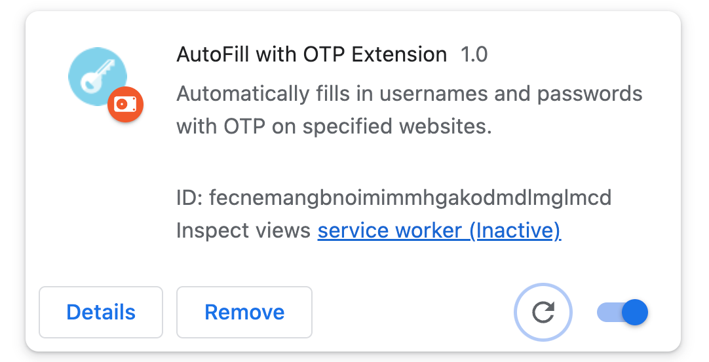
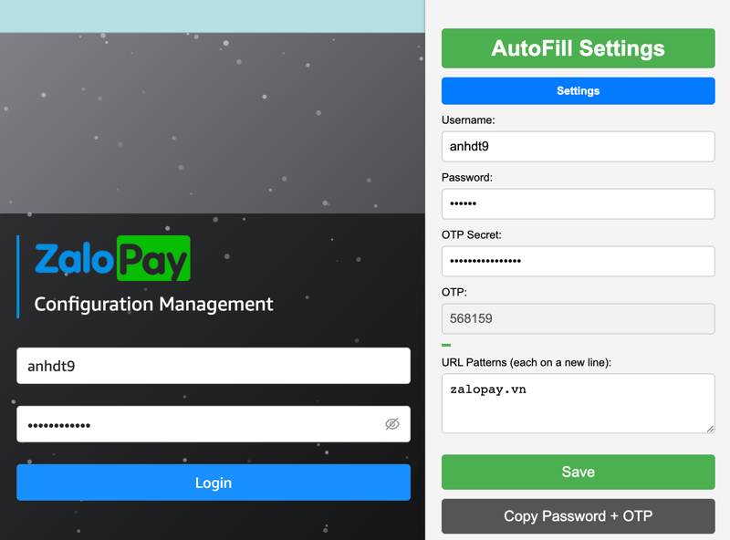

# AutoFill-with-OTP Extension



## Overview

The **AutoFill with OTP** Chrome extension is a seamless solution that automates the process of inputting usernames, passwords, and One-Time Passwords (OTP) on user-specified web pages. Designed for enhancing the user experience on sites requiring added OTP security, the extension ensures efficient logins while prioritizing data security.

## Key Features

- **Swift Autofill**: Automatically inputs username and password on designated web pages.
- **On-the-Go OTP Generation**: Instantly produces OTPs for login procedures.
- **Clipboard Functionality**: Enables quick copying of OTP to the clipboard.
- **Auto Submission**: Submit login forms automatically post OTP generation and input.

## Structure Project
```
AutoFill_with_OTP_Extension/
│
├── _locales/                  # For internationalization (if needed)
│   ├── en/
│   │   └── messages.json
│   └── [other languages]/
│
├── assets/                    # Store images and other assets
│   ├── images/
│   │   ├── icon16.png
│   │   ├── icon48.png
│   │   └── icon128.png
│   └── ...
│
├── js/
│   ├── background/
│   │   └── background.js      # Background script logic
│   │
│   ├── content/
│   │   └── content.js         # Content script logic
│   │
│   ├── popup/
│   │   └── popup.js           # JS for popup controls and interactions
│   │
│   └── libs/
│       └── [libraries].js     # External libraries, e.g., OTP generation library
│
├── css/
│   └── popup.css              # Styling for the popup if needed
│
├── html/
│   └── popup.html             # HTML structure of the popup
│
├── manifest.json              # Manifest file
│
└── README.md                  # Project documentation and instructions
```

## Installation

### Prerequisites

- Google Chrome browser.
- Git (for cloning the repository).

### Steps

1. **Clone the Repository**:
    ```bash
    git clone https://github.com/tasszz2k/AutoFill-with-OTP
    ```

2. **Open Chrome Extensions Page**:
    - Launch your Chrome browser.
    - Enter `chrome://extensions/` in the address bar.
    - Toggle on "Developer mode" located in the top right corner.

3. **Load the Extension**:
    - Select "Load unpacked" and navigate to the directory of the cloned repository.
    - The **AutoFill with OTP** extension should now appear in your list of Chrome extensions.

4. **Initial Configuration**:
    - Click on the newly added extension icon in your browser toolbar.
    - Follow the on-screen prompts to set it up for your desired websites.

---

## Usage

1. **Accessing the Extension**:
    - Click on the **AutoFill with OTP** extension icon in your browser toolbar to reveal the popup interface.

2. **Input User Details**:
    - Enter your preferred username, password, OTP secret key, and specify the URLs on which you'd like the autofill feature.

3. **Experience Seamless Logins**:
    - When you visit any of the designated URLs, the extension will automatically populate the username and password fields and instantly generate an OTP.

4. **Quick OTP Access**:
    - Should you need to copy the OTP, use the "Copy OTP" function within the extension's popup for a quick clipboard access.

5. **Configuration Management**:
    - To modify or update configurations, simply access the extension's popup and make the necessary changes.

## Migration
### From Backup OTP Secret Authenticator
- If you are using the Authenticator extension, follow this [guideline](docs/backup_otp_secret_authenticator.md) to migrate your OTP secret key to **AutoFill with OTP** extension.


## TODO List
### Must-Have Features
- [x] Input username, password, secret key (for OTP generation), and URLs of the website to be autofilled
- [x] Store user data in local storage
- [x] Autofill username and password fields on specified web pages
- [x] Generate OTP
- [x] Copy OTP to clipboard
- [ ] Automatically submit login form

### Nice-to-Have Features
- [ ] Encrypt user data
- [x] Show current configurations, mask sensitive data
- [ ] Enhance UI/UX