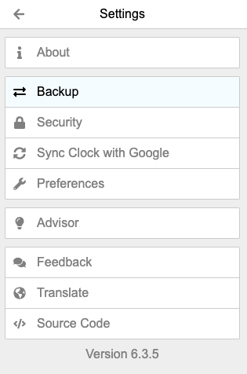
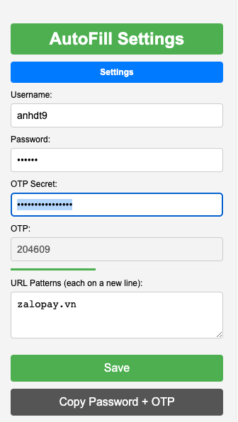

# Backup OTP Secret Authenticator



### Guideline
1. Open Authenticator Chrome Extensions Page
2. Click on `Settings` button 
3. Click on `Backup` button
4. You can see many options to back up your OTP Secret Authenticator -> select `Download backup file` option -> Save file to your computer
5. Open file that you just saved `authenticator.txt`. It has format like this:
```
otpauth://totp/NAME_1:?secret=ABCXYZAAAAAAAAAAA&issuer=NAME1
otpauth://totp/NAME_2:?secret=ABCXYZBBBBBBBBBBB&issuer=NAME2
```
6. Copy secret key of OTP Secret Authenticator and paste to `OTP Secret` of `AutoFill with OTP` extension



7. Click on `Save` button
8. Now you can use `AutoFill with OTP` extension to autofill OTP for your website